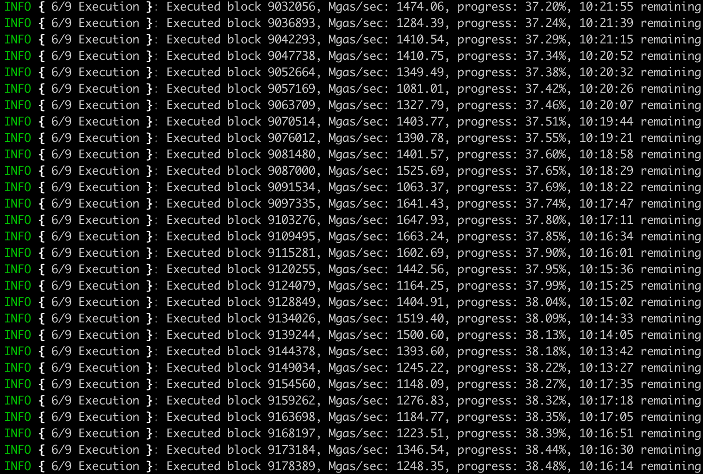

# Akula: the fastest Ethereum node ever built

Akula is a next-generation implementation of Ethereum protocol ("client") written in Rust.

<small>Akula (_Акула_) is pronounced as `ah-koo-lah` and stands for _shark_ in Russian.</small>

## Key benefits:

Much lower disk footprint
- <2TB for Ethereum mainnet archive node, <600GB for pruned node.
Faster sync speed
- An archive full validation node can be bootstrapped in under 3 days.
- Performance improvements allow Erigon to run even on HDD.
Crash resilience
- Forceful shutdown or power failure cannot damage Erigon’s database.
Extremely fast historical RPC queries like `eth_call` and `trace_callMany`
- Out-of-the-box support for [Otterscan](https://otterscan.io): very-fast and privacy-friendly local block explorer.

Here is how fast execution is: look at Mgas/s.

## Network & consensus engine support
Akula supports the following networks out of the box:
- Ethereum ("mainnet")
- Sepolia
- Goerli
- Ropsten
- Rinkeby

Additionally, users can join any other network, provided their own chain specification file, and if the network uses any of the following consensus engines:
- Ethash
- Ethereum beacon chain consensus
- Clique
